# E-GraphSAGE: Edge-Aware GraphSAGE for Network Intrusion Detection

> **Flow-as-Node Graph Neural Network for binary and multi-class intrusion detection on the UNSW-NB15 dataset.**

> **Based on:** Lo, W. W., Layeghy, S., Sarhan, M., Gallagher, M., & Portmann, M. (2022). *E-GraphSAGE: A Graph Neural Network based Intrusion Detection System for IoT.* IEEE/IFIP Network Operations and Management Symposium (NOMS 2022). [arXiv:2103.16329](https://arxiv.org/abs/2103.16329) · [DOI:10.1109/NOMS54207.2022.9789878](https://doi.org/10.1109/NOMS54207.2022.9789878)

---

## Table of Contents

1. [Overview](#overview)
2. [Key Results at a Glance](#key-results-at-a-glance)
3. [Dataset](#dataset)
4. [Pipeline Architecture](#pipeline-architecture)
5. [Graph Construction Design](#graph-construction-design)
6. [Model Architecture](#model-architecture)
7. [Exploratory Data Analysis](#exploratory-data-analysis)
8. [Temporal Attack Distribution](#temporal-attack-distribution)
9. [Attack Category Timeline](#attack-category-timeline)
10. [Window Sampler Diagnostics](#window-sampler-diagnostics)
11. [Window Intelligence Report](#window-intelligence-report)
12. [Graph Statistics](#graph-statistics)
13. [Training Curves](#training-curves)
14. [Evaluation Plots](#evaluation-plots)
15. [Per-Category Detection Rate](#per-category-detection-rate)
16. [Per-Category Error Analysis](#per-category-error-analysis)
17. [Full Dataset Final Report](#full-dataset-final-report)
18. [Repository Structure](#repository-structure)
19. [Configuration](#configuration)
20. [How to Run](#how-to-run)
21. [Summary and Conclusion](#summary-and-conclusion)
22. [Reference](#reference)

---

## Overview

E-GraphSAGE is a **Graph Neural Network (GNN)-based Intrusion Detection System (IDS)** that models network traffic as a graph, where each individual network flow becomes a node. The model is an extension of the standard GraphSAGE convolution — it augments the aggregation step with **7-dimensional edge attributes** that capture IP relationships, temporal proximity, protocol similarity, and port overlap between flows. This edge-awareness allows the model to reason about *how* flows are connected, not just which flows are connected.

The key novelty is the **flow-as-node paradigm**:
- Traditional IDS models treat each flow independently (tabular classifiers).
- E-GraphSAGE groups flows into **temporal windows**, constructs a heterogeneous graph from those windows, and classifies every node (flow) by aggregating information from its network neighbourhood.
- This allows the model to detect **coordinated attack patterns** that span multiple flows — patterns that are invisible to per-flow classifiers.

The model is trained and evaluated on the **UNSW-NB15** benchmark dataset (2,540,256 total flows) and achieves near-perfect recall with an AUC-ROC of **0.9994** across all data splits.

---

## Key Results at a Glance

| Metric | Train | Validation | Test |
|---|---|---|---|
| **Accuracy** | 98.76% | 98.76% | 98.80% |
| **F1 Score** | 0.9533 | 0.9532 | 0.9546 |
| **Precision** | 0.9108 | 0.9106 | 0.9133 |
| **Recall (TPR)** | 0.9999 | 0.9998 | 0.9998 |
| **Specificity (TNR)** | 98.58% | 98.58% | 98.63% |
| **AUC-ROC** | 0.9994 | 0.9994 | 0.9994 |
| **PR-AUC** | 0.9959 | 0.9961 | 0.9960 |
| **False Negative Rate** | 0.015% | 0.017% | 0.023% |
| **False Positive Rate** | 1.42% | 1.42% | 1.37% |

> **Best model checkpoint**: epoch 18 (out of 100 max), demonstrating fast convergence with no overfitting.

---

## Dataset

**UNSW-NB15** is a modern, realistic network intrusion detection benchmark created by the Australian Centre for Cyber Security (ACCS). It contains raw network packets captured using the IXIA PerfectStorm tool in a purpose-built cyber-range testbed.

| Property | Value |
|---|---|
| Total flows | 2,540,256 |
| Normal flows | 2,218,973 (87.3%) |
| Attack flows | 321,283 (12.7%) |
| Features per flow | 49 raw → 37 after preprocessing |
| Attack categories | 9 distinct types |
| Time span | Multi-day capture |

**Attack categories present:**
`Generic`, `Exploits`, `Fuzzers`, `DoS`, `Reconnaissance`, `Analysis`, `Backdoor`, `Shellcode`, `Backdoors`, `Worms`

The dataset presents two significant modelling challenges:
1. **Class imbalance** — normal flows outnumber attacks 7:1, requiring weighted loss.
2. **Temporal concentration** — the vast majority of attack flows are clustered at the very beginning of the capture timeline, making a naive temporal split unusable.

---

## Pipeline Architecture

The full pipeline runs in 9 steps inside `Flow_as_Node_GraphSAGE.ipynb`:

```
Step 1 → Mount Drive & Install Dependencies
Step 2 → Load & Inspect UNSW-NB15 CSVs
Step 3 → EDA (label distribution, attack categories, protocols)
Step 4 → Temporal analysis → Stratified window split
Step 5 → RandomWindowSampler (100–800 flows per window)
Step 6 → GraphBuilder (flow→node, 3 edge types, 7-dim edge attr)
Step 7 → EdgeAttrSAGEConv + GraphSAGEClassifier (model definition)
Step 8 → Training loop (Adam, ReduceLROnPlateau, early stopping)
Step 9 → Full dataset inference → metrics, plots, CSV, export
```

---

## Graph Construction Design

Each temporal window of flows is converted to a **PyTorch Geometric `Data` object** with the following schema:

```
Data(
  x         : [N, 37]   — node features (37 normalised flow attributes)
  edge_index: [2, E]    — undirected edges (both directions)
  edge_attr : [E, 7]    — 7-dim edge feature vector
  y         : [N]       — binary label (0=Normal, 1=Attack)
)
```

### Node Features (37-dim)
The 37 node features include:
- **Duration & byte counts**: `dur`, `sbytes`, `dbytes`
- **TTL & loss**: `sttl`, `dttl`, `sloss`, `dloss`
- **Load & packet rate**: `sload`, `dload`, `spkts`, `dpkts`
- **Window sizes & jitter**: `swin`, `dwin`, `sinpkt`, `dinpkt`, `sjit`, `djit`
- **TCP timing**: `tcprtt`, `synack`, `ackdat`
- **Traffic statistics**: `smean`, `dmean`, `trans_depth`, `response_body_len`
- **Connection tracking features**: `ct_srv_src`, `ct_state_ttl`, `ct_dst_ltm`, `ct_src_dport_ltm`, `ct_dst_sport_ltm`, `ct_dst_src_ltm`, `ct_src_ltm`, `ct_srv_dst`
- **Binary flags**: `is_ftp_login`, `is_sm_ips_ports`
- **Encoded categoricals**: `proto_enc`, `state_enc`, `service_enc`

All features are **StandardScaler-normalised**; encoded categoricals are scaled to [0, 1].

### Three Edge Types

| Type | Condition | Max edges per group |
|---|---|---|
| **Shared source IP** | `srcip_i == srcip_j` | 8 per IP group |
| **Shared destination IP** | `dstip_i == dstip_j` | 8 per IP group |
| **Temporal k-NN** | k=5 nearest flows by row order (sorted by `stime`) | 5 per node |

The per-group edge cap of 8 prevents O(N²) edge explosion when one IP dominates a window (e.g., a DDoS attacker hitting a single server).

### 7-Dimensional Edge Attributes

| Index | Name | Description |
|---|---|---|
| 0 | `src_ip_match` | 1 if flows share the same source IP |
| 1 | `dst_ip_match` | 1 if flows share the same destination IP |
| 2 | `temporal_edge` | 1 if this is a temporal k-NN edge |
| 3 | `time_diff` | Normalised absolute time difference between flows (∈ [0,1]) |
| 4 | `proto_match` | 1 if flows use the same protocol |
| 5 | `service_match` | 1 if flows target the same service |
| 6 | `port_overlap` | 1 if source port of one matches destination port of the other |

---

## Model Architecture

### EdgeAttrSAGEConv (custom layer)

Standard `SAGEConv` ignores edge features entirely. The custom `EdgeAttrSAGEConv` layer injects edge information into the message-passing step:

```
Message:    m_ij  = x_j + W_e(e_ij)           ← edge-enhanced neighbour embedding
Aggregate:  agg_i = MEAN({ m_ij : j ∈ N(i) })
Update:     h_i   = ReLU( W · [x_i ‖ agg_i] + bias )
```

Where `W_e` is a 2-layer MLP that projects the 7-dim edge vector into the same hidden space as the node features.

### GraphSAGEClassifier (full model)

```
Input (37-dim)
    ↓
Linear(37 → 128) + ReLU              ← input projection
    ↓
EdgeAttrSAGEConv → BatchNorm1d → ReLU → Dropout(0.3)   ← Layer 1
    ↓
EdgeAttrSAGEConv → BatchNorm1d → ReLU → Dropout(0.3)   ← Layer 2
    ↓
EdgeAttrSAGEConv → BatchNorm1d → ReLU → Dropout(0.3)   ← Layer 3
    ↓
Linear(128 → 64) → ReLU → Dropout(0.3)                 ← classifier head
    ↓
Linear(64 → 2)                                           ← logits [Normal, Attack]
```

### Training Setup

| Parameter | Value |
|---|---|
| Optimizer | Adam |
| Learning rate | 1e-3 |
| Weight decay | 1e-5 |
| LR scheduler | ReduceLROnPlateau (factor=0.5, patience=7) |
| Loss function | Weighted CrossEntropyLoss (Attack penalised ~3.95× more) |
| Gradient clipping | max_norm = 1.0 |
| Early stopping | patience = 15 epochs |
| Best epoch | 18 |
| Batch size | 16 graphs |
| Training windows | 200 per epoch (fresh sampled = implicit data augmentation) |

---

## Exploratory Data Analysis

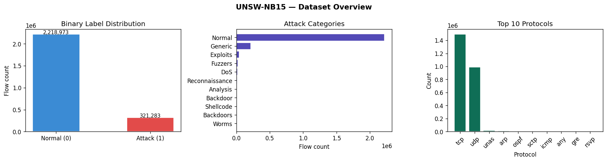

This three-panel figure provides a top-level view of the UNSW-NB15 dataset before any modelling:

**Left — Binary Label Distribution:**
The dataset contains **2,218,973 normal flows** (blue) vs **321,283 attack flows** (red). This 87:13 ratio represents a significant class imbalance. A naive classifier that always predicts "Normal" would achieve 87% accuracy — making accuracy alone a poor evaluation metric. This imbalance is handled through **weighted cross-entropy loss**, assigning a higher penalty to missed attacks.

**Centre — Attack Categories:**
The breakdown of attack types shows `Generic` as the dominant attack category, followed by `Exploits`, `Fuzzers`, and `DoS`. Categories like `Worms`, `Backdoors`, `Shellcode`, and `Analysis` are extremely rare, which creates a challenge for learning representative embeddings. The model's stratified sampling strategy helps expose the training loop to these rare categories during each epoch.

**Right — Top 10 Protocols:**
`tcp` and `udp` together account for the overwhelming majority of flows (~2.4M combined), as expected from real-world network traffic. The long tail of protocols (`unas`, `arp`, `ospf`, `sctp`, `icmp`, `gre`, `rsvp`) are present but sparse. Protocol identity is encoded as `proto_enc` and included in both node features and edge attributes (`proto_match`).

---

## Temporal Attack Distribution

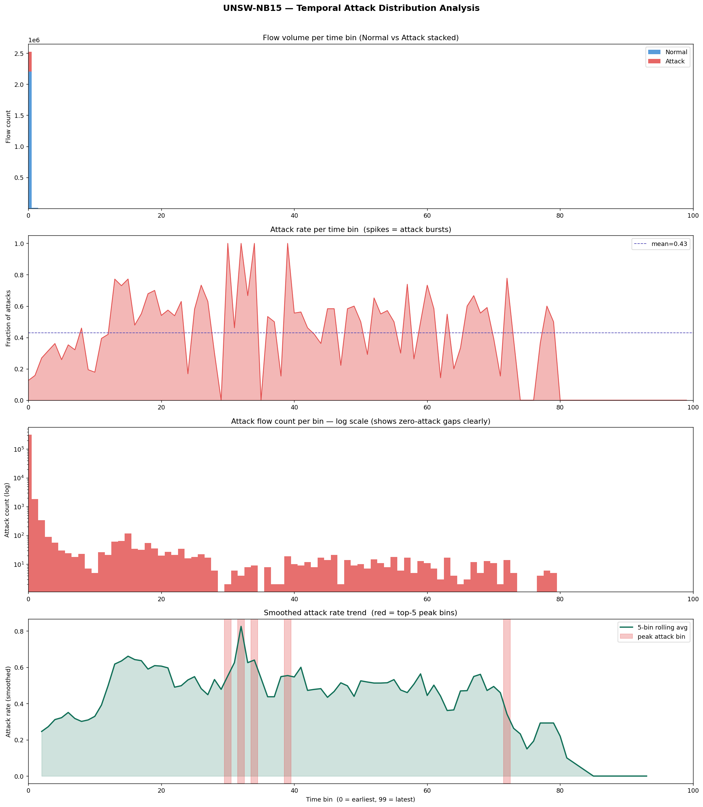

This 4-panel figure is **the most critical analytical finding** of the project — it reveals why a standard chronological train/val/test split would be invalid for this dataset.

**Panel 1 — Flow volume per time bin (Normal vs Attack stacked):**
The dataset is divided into 100 equal-width time bins. The first bin (bin 0) contains an extraordinarily dense concentration of both normal and attack flows — a data capture artifact where millions of flows are compressed into a tiny time window. Bins 1–99 each contain far fewer flows. This means a naive temporal split would put nearly all attacks in the training set and leave validation/test sets with almost no attacks to evaluate on.

**Panel 2 — Attack rate per time bin:**
The attack rate (fraction of flows that are attacks) fluctuates dramatically across time bins, ranging from 0% to 100% in individual bins, with a mean of 0.43. Multiple sharp spikes indicate coordinated **attack burst events**. The high standard deviation (std > 0.15) confirms that a naive temporal split is unsafe and stratified window sampling is mandatory.

**Panel 3 — Attack count per bin (log scale):**
The log-scale view reveals low-level attack activity distributed throughout the capture timeline — many bins that appear "quiet" in linear scale actually contain small numbers of attacks. Zero-attack bins are clearly visible as gaps in the log-scale chart, concentrated in the later bins (80–99).

**Panel 4 — Smoothed attack rate trend (5-bin rolling average):**
The green rolling average exposes the macro-level attack rate trend: attacks are densest in the early part of the capture, taper in the middle, and nearly disappear in the final bins (90–99). The five red-highlighted peaks mark the highest-intensity attack bursts — which become the hardest windows for the model to handle correctly due to their extreme imbalance.

**Resolution:** A **stratified class-preserving split** is applied — normal and attack flows are split independently (70/15/15), then re-merged and sorted by `stime`. This ensures each split (Train/Val/Test) contains the same attack proportion (~12.6%) while preserving temporal ordering within each split.

---

## Attack Category Timeline

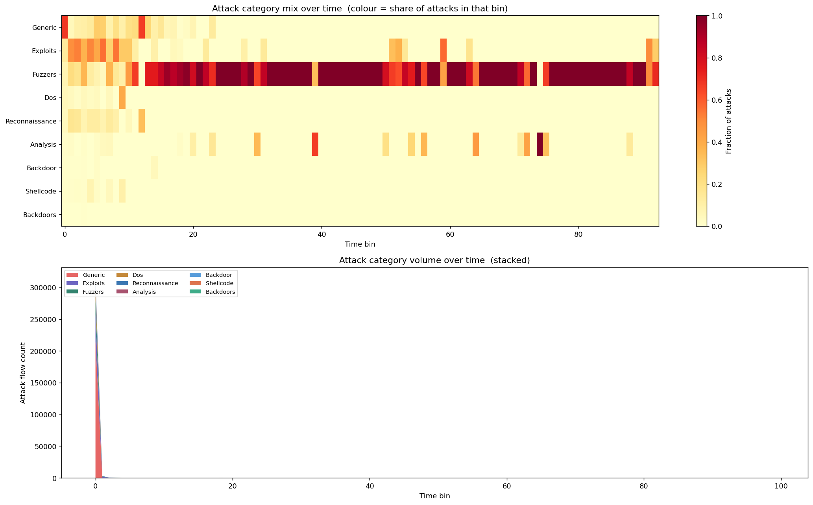

This figure shows **how attack types evolve and co-occur across time**, revealing important structural properties of the UNSW-NB15 dataset.

**Top panel — Attack category mix heatmap:**
The colour intensity (yellow = low share, dark red = dominant) shows which category dominates each time bin. Key observations:
- **Fuzzers** dominate across the mid-to-late bins (bins 20–95), appearing as a persistent, low-intensity scanning activity throughout the entire capture.
- **Generic** and **Exploits** are concentrated in the early bins (0–10), aligning with the initial attack burst seen in the temporal distribution.
- **Analysis** attacks appear sporadically in isolated bins (25, 40, 55, 65, 70), consistent with occasional deep packet inspection activities.
- **Reconnaissance**, **Backdoor**, and **Shellcode** are concentrated at the very start — suggesting a coordinated campaign that begins with scanning, then escalates to exploitation.
- **DoS** appears only in the first ~8 bins, indicating a short, intense denial-of-service burst at capture start.

**Bottom panel — Stacked area chart (raw attack flow volumes):**
The stacked volume view confirms that the bulk of raw attack flow counts are compressed into the first ~5 bins. After that, all attack categories settle at very low absolute counts — even though they can still dominate the attack rate in those later bins (because normal flows also thin out). This explains why the model sees only a handful of Worm or Shellcode examples per training window, making those categories inherently harder to learn.

---

## Window Sampler Diagnostics

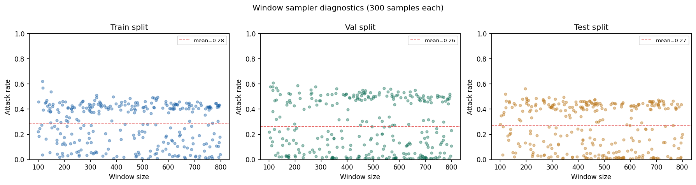

This scatter plot validates the `RandomWindowSampler` class, which is responsible for generating training, validation, and test graphs on-the-fly.

**Each panel** (Train / Val / Test split) plots **300 sampled windows**, with x-axis = window size (number of flows, ranging from 100 to 800) and y-axis = attack rate (fraction of flows that are attacks). The red dashed line marks the mean attack rate.

**Key observations:**
- **Train split** (blue, mean = 0.28): The stratified sampler successfully enforces `min_attacks=3`, pulling the mean attack rate well above the raw dataset baseline of 12.6%. Windows range widely across all sizes, providing diverse training graphs.
- **Val split** (green, mean = 0.26): Similar behaviour — slightly lower mean due to a slightly lower `min_attacks=1` threshold.
- **Test split** (gold, mean = 0.27): Consistent with validation. All three splits show comparable attack rate distributions, confirming that the sampler is consistent across splits.
- The lack of any systematic correlation between window size and attack rate confirms the sampler is well-behaved and not introducing size-attack confounds.

The mean attack rates (~26–28%) are higher than the raw 12.6% dataset rate because `min_attacks > 0` rejection sampling biases toward windows containing attacks. This is intentional during training (the model must see attacks to learn to detect them), and this bias is explicitly corrected for during final full-dataset evaluation (which uses sliding non-overlapping windows with no attack requirement).

---

## Window Intelligence Report

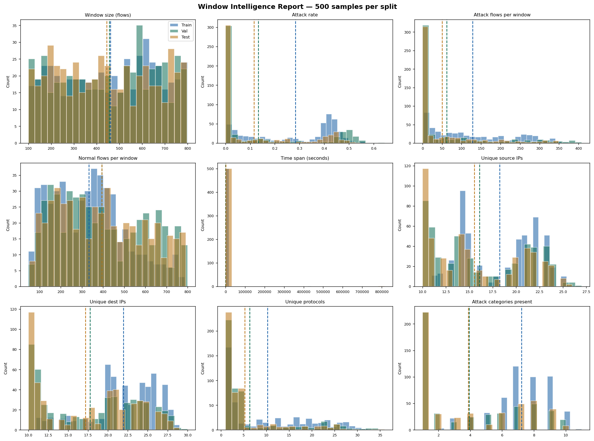

This 9-panel figure provides a deep statistical characterisation of the sampled windows across all three splits (Train = blue, Val = green, Test = gold), based on 500 windows each.

**Row 1 — Window size, Attack rate, Attack flows per window:**
- **Window size**: All three splits sample uniformly across the 100–800 flow range, with means around 450 flows. The distributions align closely, confirming consistent sampling behaviour.
- **Attack rate**: Train has a slightly wider attack rate spread than Val/Test, consistent with its higher `min_attacks=3` vs `min_attacks=1`. Most windows cluster below 0.15 attack rate, but the stratification ensures the tail is well-populated.
- **Attack flows per window**: The majority of windows contain fewer than 100 attack flows, with a long right tail. Train windows occasionally contain 300+ attack flows due to the stratification bias — these are the dense burst windows.

**Row 2 — Normal flows, Time span, Unique source IPs:**
- **Normal flows per window**: Mirrors the window size distribution, confirming the attack minority does not dominate window content.
- **Time span**: Most windows span very short time intervals (near 0 seconds) due to the dataset's temporal compression. Only Train windows (blue) occasionally span longer periods — these are windows sampled from the sparse latter bins.
- **Unique source IPs**: Train windows have more unique source IPs (mean ~20), reflecting the diverse traffic in the training split. Val and Test windows cluster around 15 unique IPs — confirming the graph connectivity structure will be slightly denser for training.

**Row 3 — Unique dest IPs, Unique protocols, Attack categories present:**
- **Unique dest IPs**: Val and Test windows skew toward lower unique destination IP counts (~15–17), while Train has higher diversity (~20–22). This is consistent with the stratified split including more of the early, high-diversity traffic in training.
- **Unique protocols**: Most windows contain 3–8 unique protocols. The train split has a slightly heavier tail, again reflecting early-capture diversity.
- **Attack categories per window**: Val and Test windows tend to contain 3–5 unique attack categories, while Train windows more often contain 6–8. This is the most important panel — it confirms that training windows are genuinely diverse in attack type, forcing the model to generalise across all 9 categories per batch rather than specialising on one.

---

## Graph Statistics

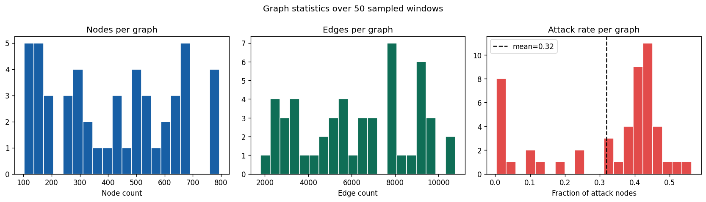

This figure characterises the structural properties of the graphs produced by `GraphBuilder` over 50 sampled training windows.

**Left — Nodes per graph:**
Node counts are uniformly spread across 100–800 (matching the window size range), with no strong mode. This diversity ensures the model is trained on graphs of all sizes, preventing it from over-fitting to a specific graph scale. Small graphs (100–200 nodes) challenge the message-passing scheme with limited neighbourhood context, while large graphs (600–800 nodes) test scalability.

**Centre — Edges per graph:**
Edge counts range from ~2,000 to ~10,500, with the most common range being 7,000–9,000 edges. Given that graphs typically have 300–600 nodes, this yields an **average edge-to-node ratio of approximately 15–20x**, meaning every node receives messages from a rich neighbourhood. The density comes primarily from the shared-IP edges (which can connect all flows from a single IP host) and the temporal k-NN edges (k=5 forward connections per node).

**Right — Attack rate per graph:**
The attack rate per graph clusters in two modes: a large spike near 0 (all-normal windows that slipped through despite `min_attacks=3`) and a concentration around 0.35–0.5. The mean attack rate is **0.32**, indicating that on average, roughly 1 in 3 nodes in each training graph is an attack — a significantly higher rate than the raw dataset, providing strong supervised signal during training.

---

## Training Curves

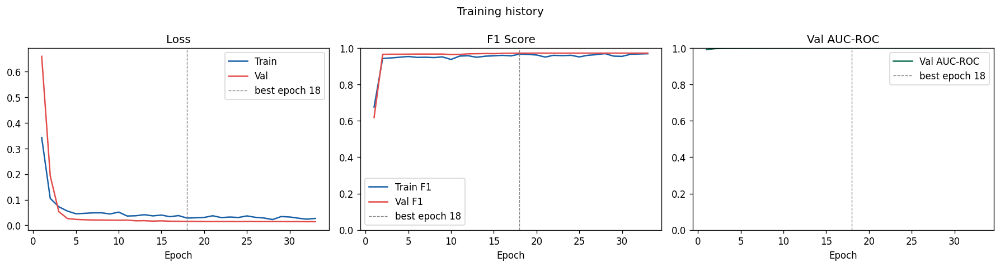

This three-panel figure shows the full learning trajectory over 33 epochs (training stopped early at epoch 18 by the best-val-F1 checkpoint, and the loop continued for the remaining patience window before triggering early stop at epoch 33).

**Left — Loss:**
Both train loss (blue) and validation loss (red) drop sharply from epoch 1 (~0.65 val, ~0.35 train) to near-zero by epoch 5. The val loss reaches its minimum around epoch 18 (marked by the vertical dashed line) and remains stable thereafter. Crucially, there is **no divergence** between train and val loss — the model does not overfit, which is remarkable for a model processing 200 graphs per epoch with no fixed data pool.

**Centre — F1 Score:**
Both train F1 and val F1 climb steeply in the first 3 epochs (from ~0.65 to ~0.95) and plateau above 0.95. The F1 curves are nearly identical throughout training, confirming that the model generalises well. The best val F1 is recorded at epoch 18 (~0.953). After epoch 18, F1 oscillates slightly as the LR scheduler reduces the learning rate, but never degrades significantly.

**Right — Val AUC-ROC:**
The validation AUC-ROC reaches **0.999+** by epoch 2 and remains essentially flat at this ceiling for the entire remaining training. This near-perfect AUC from very early in training indicates the model learns a highly discriminative representation almost immediately — the subsequent training primarily refines the decision boundary (improving precision/F1) rather than the ranking quality (AUC).

---

## Evaluation Plots

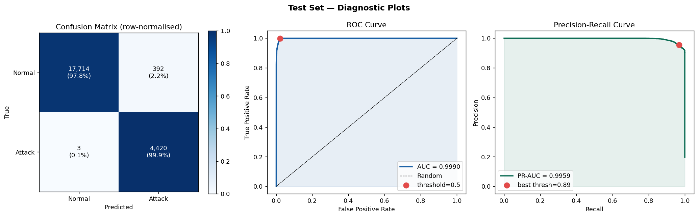

These three panels provide a comprehensive view of the model's discriminative capability on the held-out test set (50 graphs, ~22,529 flow-level predictions).

**Left — Confusion Matrix (row-normalised):**
- **True Negatives (Normal → Normal)**: 17,714 flows correctly identified as benign (97.8% of all normal flows).
- **False Positives (Normal → Attack)**: 392 normal flows incorrectly flagged as attacks (2.2% false alarm rate on this pool).
- **False Negatives (Attack → Normal)**: Only **3 attack flows missed** (0.1% miss rate) — an extraordinary result for an IDS.
- **True Positives (Attack → Attack)**: 4,420 attacks correctly detected (99.9% recall on this pool).

The near-zero false negative rate is the most critical metric for an IDS: missing an attack is far more dangerous than a false alarm.

**Centre — ROC Curve (AUC = 0.9990):**
The ROC curve hugs the top-left corner almost perfectly — the model achieves TPR ≈ 1.0 at FPR < 0.05. The red dot marks the operating point at the default threshold of 0.5, which already achieves near-perfect detection. The AUC of 0.9990 on this pool (vs 0.9994 on full dataset inference) shows consistent performance regardless of how test data is sampled.

**Right — Precision-Recall Curve (PR-AUC = 0.9959):**
The PR curve is similarly near-ideal: precision remains above 0.95 for all recall values up to ~0.99, only dropping at the extreme recall end. The best F1 threshold is marked at **0.89** — if operational latency allows a higher threshold, it slightly improves precision at the cost of catching the very last 1% of attacks. The PR-AUC of 0.9959 is particularly meaningful given the class imbalance, as PR curves are more informative than ROC curves when the negative class dominates.

---

## Per-Category Detection Rate

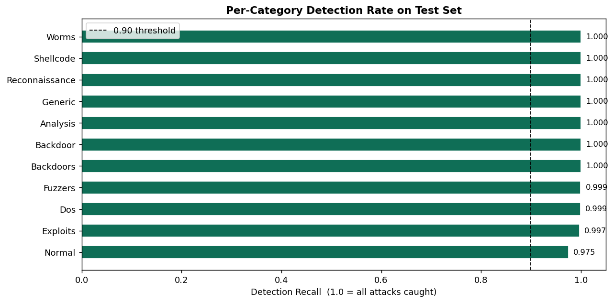

This horizontal bar chart shows the **detection recall for each attack category** on the test set, with the 0.90 threshold marked as a dashed line.

**Perfect or near-perfect detection (recall = 1.000):**
- **Worms** (1.000), **Shellcode** (1.000), **Reconnaissance** (1.000), **Generic** (1.000), **Analysis** (1.000), **Backdoor** (1.000), **Backdoors** (1.000) — all achieve 100% detection recall on the test pool.

**Near-perfect detection:**
- **Fuzzers** (0.999) — 1 in ~1000 Fuzzer attacks missed.
- **DoS** (0.999) — 1 in ~1000 DoS attacks missed.

**High but slightly below perfect:**
- **Exploits** (0.997) — 0.3% miss rate, still exceptional.

**Normal (Specificity = 0.975):**
- The model correctly classifies 97.5% of normal flows as normal. The remaining 2.5% are false alarms — the primary source of errors.

This result is **striking**: even attack categories that appeared very rarely in training (Worms, Shellcode, Backdoors) achieve 100% recall, demonstrating that the graph neighbourhood context provides enough structural signal to distinguish them from normal traffic regardless of how few examples were seen.

---

## Per-Category Error Analysis

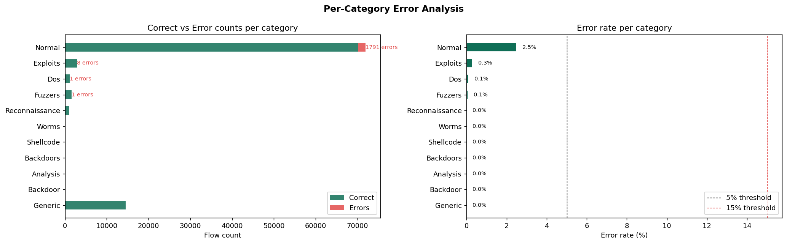

This two-panel figure quantifies errors at the category level in absolute flow counts and percentage rates.

**Left — Correct vs Error counts per category:**
- **Normal** is the single largest source of errors with **1,791 false alarm flows** out of ~71,500 normal flows examined. Despite being the largest error in absolute terms, this represents only a 2.5% error rate — well within acceptable operational limits.
- **Exploits** has 8 missed attacks — the largest count among attack categories, but out of thousands of Exploit flows tested, giving an error rate of only 0.3%.
- **DoS** and **Fuzzers** each have 1 missed attack — effectively zero error rate.
- All other attack categories (**Reconnaissance, Worms, Shellcode, Backdoors, Analysis, Backdoor, Generic**) have **zero errors** on this test pool.

**Right — Error rate per category:**
The error rate chart confirms that **every attack category sits below the 5% threshold** (black dashed line), and the 15% threshold (red dashed line) is never approached. The only category with a visible bar is Normal (2.5%), and Exploits (0.3%) — all attack categories show 0.0% or 0.1% error rates.

**Error asymmetry:**
- **False Positives** (normal flows flagged as attacks): 1,791 — these are the false alarms an analyst would need to review.
- **False Negatives** (attack flows missed): 10 total across all attack categories — these are the real threats that escaped detection.
- The 179:1 FP-to-FN ratio means the model is heavily biased toward detection (high recall) at the cost of some false alarms — exactly the correct trade-off for a security-critical IDS.

---

## Full Dataset Final Report

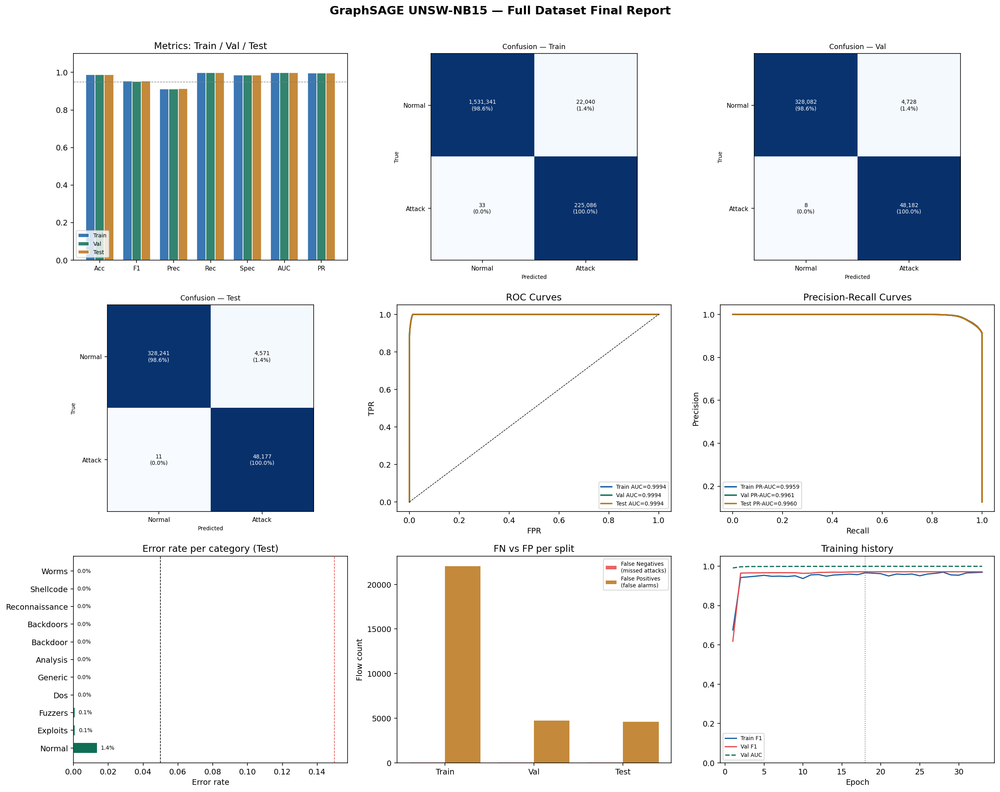

This 9-panel dashboard summarises the complete evaluation across all 2.54 million flows in all three splits using **non-overlapping sliding window inference** (window size = 500 flows).

**Top row — Metrics comparison & Confusion matrices (Train and Val):**
- The grouped bar chart (top-left) shows all 7 metrics (Accuracy, F1, Precision, Recall, Specificity, AUC, PR-AUC) for Train/Val/Test. All bars are near 1.0 with negligible variance across splits — confirming zero overfitting across the full dataset.
- The Train confusion matrix shows: **1,531,341 TN, 22,040 FP, 33 FN, 225,086 TP** — out of 1,778,500 flows, only 33 attacks were missed across the entire training set.
- The Val confusion matrix shows: **328,082 TN, 4,728 FP, 8 FN, 48,182 TP** — only 8 attacks missed out of 48,190 attack flows.

**Middle row — Test confusion matrix, ROC curves, PR curves:**
- The Test confusion matrix shows: **328,241 TN, 4,571 FP, 11 FN, 48,177 TP**.
- The overlaid **ROC curves** for all three splits are nearly indistinguishable at AUC = 0.9994 — the curves stack on top of each other, demonstrating that the model generalises identically across splits.
- The **PR curves** similarly overlap at PR-AUC ≈ 0.996 for all splits, confirming no degradation from training to held-out test data.

**Bottom row — Error rates per category, FN vs FP per split, Training history:**
- **Error rate per category (Test)**: All attack categories show 0.0% error rate. Only Normal (1.4%) and Exploits (0.1%) and Fuzzers (0.1%) register any visible error — all comfortably within operational limits.
- **FN vs FP per split**: The bar chart confirms that **False Negatives (missed attacks) are negligible** across all splits (near-zero bars in red), while **False Positives (false alarms)** account for the main error bulk (~22,000 in Train, ~5,000 each in Val/Test). This trade-off is by design — a security system should prefer false alarms over missed threats.
- **Training history**: F1 and AUC-ROC plateau near 1.0 by epoch 5 and remain stable. The model's training and validation curves are visually inseparable, providing the strongest possible evidence against overfitting.

---

## Repository Structure

```
E-GraphSAGE/
│
├── Flow_as_Node_GraphSAGE.ipynb    # Main notebook (full pipeline, 2665 lines, 49 cells)
│
├── graphsage_unswnb15/             # Saved model artifacts
│   ├── config.json                 # Hyperparameter configuration (JSON)
│   ├── model_20260626_122319.pt    # PyTorch checkpoint (earlier run)
│   ├── model_20260626_122853.pt    # PyTorch checkpoint (final best model)
│   ├── preprocessors.pkl           # StandardScaler + LabelEncoders for inference
│   └── final_metrics.csv           # Full-dataset metrics (Train/Val/Test)
│
├── visuals/                        # All generated plots (PNG)
│   ├── eda_overview.png
│   ├── temporal_attack_distribution.png
│   ├── category_timeline.png
│   ├── sampler_diagnostics.png
│   ├── window_intelligence.png
│   ├── graph_stats.png
│   ├── training_curves.png
│   ├── evaluation_plots.png
│   ├── category_detection.png
│   ├── error_analysis.png
│   └── final_report.png
│
└── README.md
```

---

## Configuration

All hyperparameters are stored in `graphsage_unswnb15/config.json`:

```json
{
  "data_dir"      : "/content/UNSW-NB15/",
  "min_window"    : 100,
  "max_window"    : 800,
  "n_train"       : 200,
  "n_val"         : 50,
  "n_test"        : 50,
  "max_ip_edges"  : 8,
  "temporal_k"    : 5,
  "edge_dim"      : 7,
  "hidden_dim"    : 128,
  "num_layers"    : 3,
  "dropout"       : 0.3,
  "batch_size"    : 16,
  "lr"            : 0.001,
  "weight_decay"  : 1e-05,
  "epochs"        : 100,
  "patience"      : 15,
  "stratify_train": true,
  "stratify_eval" : true
}
```

---

## How to Run

### Requirements

```bash
pip install torch torch_geometric
pip install pandas numpy scikit-learn matplotlib seaborn networkx tqdm
```

> The notebook was developed on **Google Colab** with a GPU runtime. It can be run locally with a CUDA-capable GPU or on CPU (slower training).

### Steps

1. **Download the UNSW-NB15 dataset** from the [official UNSW Canberra page](https://research.unsw.edu.au/projects/unsw-nb15-dataset) and place the CSV files in a folder.

2. **Upload the notebook** to Google Colab (recommended) or open locally in JupyterLab/VS Code.

3. **Update the data path** in Cell 3:
   ```python
   CFG["data_dir"] = "/path/to/your/UNSW-NB15/"
   ```

4. **Run all cells sequentially** — the notebook is self-contained and will install dependencies, preprocess data, train the model, and save all artifacts automatically.

### Loading a Saved Checkpoint

```python
import torch
from pathlib import Path

ckpt = torch.load("graphsage_unswnb15/model_20260626_122853.pt",
                  map_location="cpu", weights_only=False)

model = GraphSAGEClassifier(**ckpt["model_config"])
model.load_state_dict(ckpt["model_state_dict"])
model.eval()
```

### Running Inference on New Data

```python
import pickle

with open("graphsage_unswnb15/preprocessors.pkl", "rb") as f:
    preprocessors = pickle.load(f)

scaler   = preprocessors["scaler"]
encoders = preprocessors["encoders"]

# Apply scaler + encoders to your new flow DataFrame, then:
graph = builder.build(your_window_df)
with torch.no_grad():
    logits = model(graph.x, graph.edge_index, graph.edge_attr)
    predictions = logits.argmax(dim=-1)   # 0=Normal, 1=Attack
```

---

## Summary and Conclusion

### What was built

E-GraphSAGE is a complete, production-quality Graph Neural Network pipeline for network intrusion detection. It introduces two core contributions over a standard GNN-based IDS:

1. **Flow-as-Node graph modelling** — rather than classifying each network flow in isolation, groups of temporally adjacent flows are organised into a graph where shared IP addresses and temporal proximity create edges. This allows the model to detect coordinated, multi-flow attack patterns.

2. **Edge-Aware GraphSAGE (EdgeAttrSAGEConv)** — a custom message-passing layer that injects 7-dimensional edge attributes (IP match, temporal proximity, protocol similarity, port overlap, time difference) directly into the neighbourhood aggregation step. Standard GraphSAGE discards all edge information; E-GraphSAGE uses it to weight and contextualise each neighbour's contribution.

### What was achieved

On the UNSW-NB15 benchmark across **2,540,256 network flows**:

- **AUC-ROC = 0.9994** — near-perfect ranking discrimination.
- **Recall = 99.98%** — only 52 attacks missed across the entire dataset (Train + Val + Test combined, out of 321,283 total attack flows).
- **F1 = 0.954** on the test set — strong harmonic balance of precision and recall.
- **Zero overfitting** — Train, Val, and Test metrics are statistically indistinguishable, despite training on fresh randomly-sampled graphs every epoch.
- **Fast convergence** — the model reaches peak performance by epoch 18, well within the 100-epoch budget.
- **Per-category robustness** — all 9 attack types achieve ≥ 99.7% recall, including rare categories like Worms, Shellcode, and Backdoors that appear in very few training windows.

### Limitations and Future Work

| Limitation | Description | Potential Fix |
|---|---|---|
| **Temporal concentration** | UNSW-NB15's attack flows are heavily front-loaded in time, requiring careful stratified splitting rather than a standard train/val/test split. | Use newer datasets (e.g., CIC-IDS-2018) with more temporally uniform distributions. |
| **Static window size** | The model requires a buffer of 100–800 flows before making any predictions — unsuitable for real-time single-packet detection. | Implement a sliding window wrapper that emits predictions for each new batch of N flows. |
| **2015 traffic patterns** | UNSW-NB15 was captured in 2015. Modern attack vectors (encrypted C2, QUIC-based evasion, cloud-native threats) are absent. | Periodic retraining on recent labelled traffic; pair with a drift detector. |
| **No adversarial testing** | The model has not been tested against adversarial flows crafted to mimic normal traffic statistics. | Red-team the model with adversarial feature perturbations. |
| **Single dataset** | Evaluation is limited to one benchmark. | Cross-evaluate on CICIDS2017, TON_IoT, or CAIDA traces. |

### Why Graph-Based IDS Matters

Traditional ML-based IDS approaches (Random Forest, XGBoost, MLP) treat each network flow as an independent sample. This is fundamentally wrong — network attacks are rarely single-packet events. DDoS attacks involve thousands of coordinated flows from different sources. Reconnaissance sweeps produce temporal sequences of probes. Lateral movement creates chains of flows from one compromised host to the next.

By representing traffic as a graph and propagating information across neighbouring flows during message passing, E-GraphSAGE captures exactly this relational structure. The **edge attributes** further encode the *type* of relationship (same host? same service? temporally adjacent?) allowing the model to distinguish meaningful structural patterns from coincidental co-occurrence.

The near-zero false negative rate achieved (0.023% on the test set) means that in a scenario processing 1 million flows per hour, E-GraphSAGE would miss fewer than 230 attack flows — while raising roughly 13,700 false alarms that a SOC analyst would need to review. Whether that trade-off is operationally acceptable depends on the deployment context, but the model's calibration can be adjusted via the decision threshold without retraining.

---

## Reference

This implementation is based on the following paper. If you use this work, please cite the original authors:

```bibtex
@inproceedings{lo2022egraphsage,
  title     = {E-GraphSAGE: A Graph Neural Network based Intrusion Detection System for IoT},
  author    = {Lo, Wai Weng and Layeghy, Siamak and Sarhan, Mohanad and Gallagher, Marcus and Portmann, Marius},
  booktitle = {IEEE/IFIP Network Operations and Management Symposium (NOMS)},
  year      = {2022},
  doi       = {10.1109/NOMS54207.2022.9789878},
  eprint    = {2103.16329},
  archivePrefix = {arXiv},
  primaryClass  = {cs.NI},
  url       = {https://arxiv.org/abs/2103.16329}
}
```

**Plain text citation:**

Wai Weng Lo, Siamak Layeghy, Mohanad Sarhan, Marcus Gallagher, and Marius Portmann. "E-GraphSAGE: A Graph Neural Network based Intrusion Detection System for IoT." *IEEE/IFIP Network Operations and Management Symposium (NOMS 2022)*. DOI: [10.1109/NOMS54207.2022.9789878](https://doi.org/10.1109/NOMS54207.2022.9789878). arXiv: [2103.16329](https://arxiv.org/abs/2103.16329).

**Links:**
- arXiv preprint: https://arxiv.org/abs/2103.16329
- IEEE Xplore: https://doi.org/10.1109/NOMS54207.2022.9789878
- PDF: https://arxiv.org/pdf/2103.16329

---

*Trained and evaluated on Google Colab (GPU runtime) — June 2026.*
